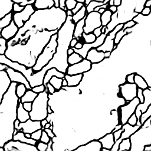

# Cell Segmentation

### Built With

* Tensorflow
* Keras 

### Data

original dataset -http://brainiac2.mit.edu/isbi_challenge/

The data for training contains 30 512*512 images,

**Data augmentation** : ImageDataGenerator in keras.preprocessing.image 

Output from the network is a 512*512 which represents mask that should be learned. 

Sigmoid activation function makes sure that mask pixels are in [0, 1] range.

### Training

Epochs = 5

Accuracy ~ 0.95.

Loss function - binary crossentropy.

## Results

